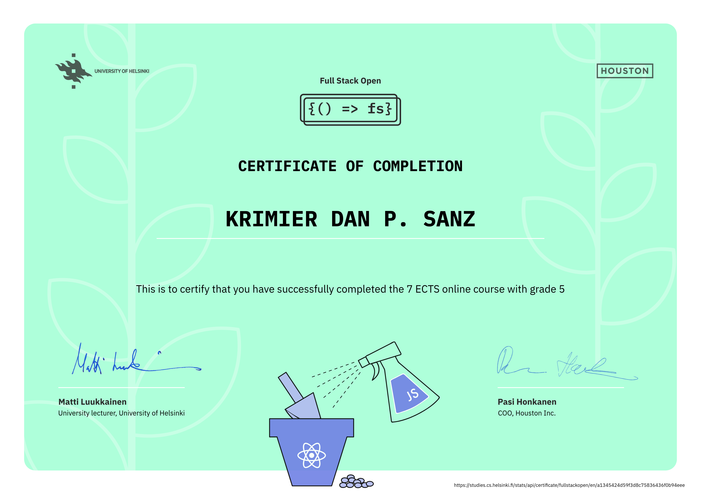

# Full Stack open

My solutions for the exercises of the [University of Helsinki](https://www.helsinki.fi/)'s [Full Stack open](https://fullstackopen.com/) course. This repository contains solutions from part 0 to part 9 of the course. Full stack open is an excellent introduction to modern web development. The core course consists of parts 0 to 5. After the core course, you can complete other parts in the order you want.

## Course content

### Part 0: Fundamentals of Web apps
- The basics of web development and also the advances in web application development during the last few decades. It includes topics such as web application structure, HTTP protocol, developer tools, traditional web applications, AJAX, single-page apps and JavaScript libraries.

### Part 1: Introduction to React
- Familiarizing with the React-library and some features of JavaScript that are important for understanding React.

### Part 2: Communicating with server
- Continuation of the introduction to React. It includes data rendering, data submit with HTML forms, fetching data from remote backend server and simple CSS styles.

### Part 3: Programming a server with NodeJS and Express
- Focuses on implementing and deploying a simple REST API to the internet. The application is developed by using Node.js and the Express library. The application data is stored in a MongoDB database.

### Part 4: Testing Express servers, user administration
- The focus is still on the backend and the key topics are writing unit and integration tests and the implementing of user authentication and authorization.

### Part 5: Testing React apps
- Deals with React code testing and token based authentication.

### Part 6: Advanced state management
- Introduction to Redux library as a solution for managing the state of the React applications. Redux provides a centralized state management solution, simplifying state updates, enhancing predictability, and facilitating debugging in complex React applications.

### Part 7: React router, custom hooks, styling app with CSS and webpack
- Getting familiar with React router as a way to divide the application into different views that are based on the URL. Also deals with custom hooks, different ways to style React applications and webpack.

### Part 8: GraphQL
- Introduction to GraphQL as an alternative to REST communication between browser and server. GraphQL allows clients to request precisely the data they need, reducing over-fetching and under-fetching, leading to more efficient and flexible APIs.

### Part 9: TypeScript
- Introduction to TypeScript that is a typed superset of Javascript. TypeScript offers static typing, enhancing code quality by catching errors at compile-time, improving code maintainability, and enabling better IDE support.

## My course progress

| Part           | Status      | Exercises |
| :------------: | :---------: | :-------: |
| [0](https://github.com/uepzues/fullstackopen/tree/main/part%200) | Done        | 6/6       |
| [1](https://github.com/uepzues/fullstackopen/tree/main/part1) | Done        | 14/14     |
| [2](https://github.com/uepzues/fullstackopen/tree/main/part2) | Done        | 20/20     |
| [3](https://github.com/uepzues/fullstackopen/tree/main/part3) | Done        | 22/22     |
| [4](https://github.com/uepzues/fullstackopen/tree/main/part4) | Done        | 23/23     |
| [5](https://github.com/uepzues/fullstackopen/tree/main/part5) | Done        | 23/23     |
| [6](https://github.com/uepzues/fullstackopen/tree/main/part6) | Done        | 24/24     |
| [7](https://github.com/uepzues/fullstackopen/tree/main/Part7) | Done        | 21/21     |
| [8](https://github.com/uepzues/fullstackopen/tree/main/part8) | In Progress | 0/26     |
| [9](https://github.com/uepzues/fullstackopen/tree/main/part9) | In Progress        | 0/29     |

## Course certificates

### Full Stack Open: core course

