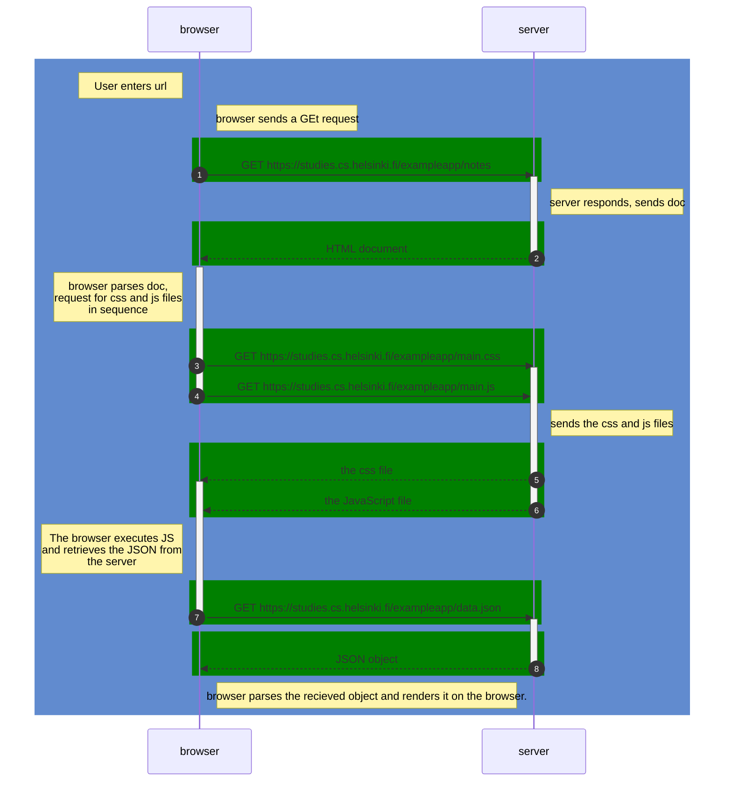

### 
Creating a New Note Diagram

```mermaid
    sequenceDiagram
    autonumber
    participant browser
    participant server

    rect rgb(97, 139, 207)
        note left of browser: User enters url
        note right of browser: browser sends a GEt request
        rect green
        browser->>server: GET https://studies.cs.helsinki.fi/exampleapp/notes
        activate server
        end

        note right of server: server responds, sends doc

        rect green
        server-->>browser: HTML document
        deactivate server
        end

        activate browser
        note left of browser: browser parses doc, <br> request for css and js files <br> in sequence
        rect green
        browser->>server: GET https://studies.cs.helsinki.fi/exampleapp/main.css
        activate server
        browser->>server: GET https://studies.cs.helsinki.fi/exampleapp/main.js
        deactivate browser
        end

        note right of server: sends the css and js files
        rect green
        server-->>browser: the css file
        activate browser
        server-->>browser: the JavaScript file
        deactivate server
        end

        Note left of browser: The browser executes JS <br> and retrieves the JSON from <br>the server
        rect green
        browser->>server: GET https://studies.cs.helsinki.fi/exampleapp/data.json
        deactivate browser
        activate server
        end

        rect green
        server-->>browser: JSON object
        deactivate server
        end
        note right of browser: browser parses the recieved object and renders it on the browser.
    end


```
