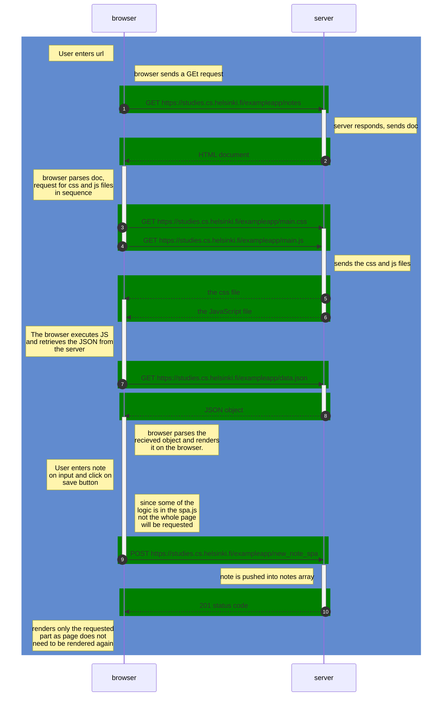

### 
New Note in Single App Diagram

```mermaid
    sequenceDiagram
    autonumber
    participant browser
    participant server

    rect rgb(97, 139, 207)
        note left of browser: User enters url
        note right of browser: browser sends a GEt request
        rect green
        browser->>server: GET https://studies.cs.helsinki.fi/exampleapp/notes
        activate server
        end

        note right of server: server responds, sends doc

        rect green
        server-->>browser: HTML document
        deactivate server
        end

        activate browser
        note left of browser: browser parses doc, <br> request for css and js files <br> in sequence
        rect green
        browser->>server: GET https://studies.cs.helsinki.fi/exampleapp/main.css
        activate server
        browser->>server: GET https://studies.cs.helsinki.fi/exampleapp/main.js
        deactivate browser
        end

        note right of server: sends the css and js files
        rect green
        server-->>browser: the css file
        activate browser
        server-->>browser: the JavaScript file
        deactivate server
        end

        Note left of browser: The browser executes JS <br> and retrieves the JSON from <br>the server
        rect green
        browser->>server: GET https://studies.cs.helsinki.fi/exampleapp/data.json
        deactivate browser
        activate server
        end

        rect green
        server-->>browser: JSON object
        deactivate server
        activate browser
        end
        note right of browser: browser parses the <br>recieved object and renders <br> it on the browser.

        note left of browser: User enters note <br> on input and click on <br> save button
        note right of browser: since some of the <br> logic is in the spa.js <br> not the whole page <br> will be requested
        rect green
        browser->>server: POST https://studies.cs.helsinki.fi/exampleapp/new_note_spa
        deactivate browser
        end

        activate server
        note left of server: note is pushed into notes array
        rect green
        server-->>browser: 201 status code
        deactivate server
        end

        note left of browser:renders only the requested <br> part as page does not <br> need to be rendered again
    end


```
